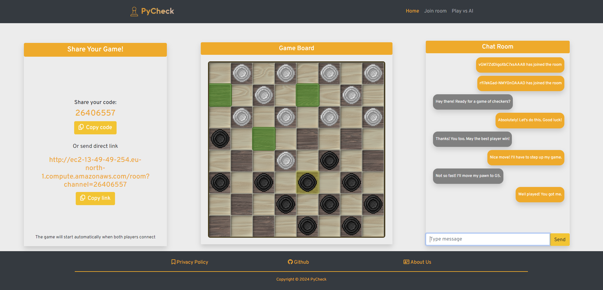

<p align="center">

</p>

# [PyCheck - Checkers Web App](https://github.com/mkrol1997/pixel-perfect/)
[](https://github.com/mkrol1997/pycheck/)
[](https://github.com/mkrol1997/pycheck/releases)


________
# Contents

* [Overview](#Overview)
* [Description](#Description)
* [Installation](#Installation-Guide)
* [Usage Instructions](#Usage-Instructions)
* [License and Acknowledgement](#License-and-Acknowledgement)

________
# Overview

The **Checkers Web App** is a dynamic web application that enables users to enjoy the classic game of American Checkers directly in their browser. Platform offers both player vs. player matches and player vs. computer matches, providing an engaging gaming experience.
PyCheck ensures instant connections between users, enabling real-time communication. Whether you're challenging a friend or engaging in a solo match against the computer, Socket.IO enables responsive gameplay with bidirectional communication.
## Technologies Used

Built using technologies, including:

- **Flask**: A Python web framework used for backend development.
- **Flask-SocketIO**: Enabling real-time bidirectional communication between the server and clients.
- **MongoDB**: A NoSQL database for scalable and flexible data management.
- **PyTest:** Testing framework for automated testing of the application.
- **Monte Carlo Algorithm (MCST):** Employs the Monte Carlo search algorithm for intelligent decision-making in the player vs. computer mode.
- **Docker and Docker-Compose:** Providing containerization and deployment simplifying, ensuring consistency across environments.
- **Portainer:** Providing management interface for Docker environments.
- **AWS EC2:** Scalable deployment platform, ensuring high availability and performance.
- **AWS ECR:** Secure storage and management for Docker container images.
- **Pipenv:** Managing project dependencies and providing a virtual environment for streamlined development.

## Play your way!

Play head-to-head against your friends or challenge a computer opponent powered by a special algorithm. Engage in practice sessions, refine your strategy, and aim for victory in every match. But most importantly, have fun!"

## Screenshots
>Click on the image to view full-size

<div align="center">
  <table>
    <tr>
      <td align="center"><p>Dashboard</p></td>
      <td align="center"><p>PvP. Room</p></td>
    </tr>
    <tr >
      <td align="center"><p>Join Room</p></td>
      <td align="center"><p>End of the Game</p></td>
    </tr>
  </table>
</div>

________
# Description

## Key Features:

### 1. Player vs. Player Game

Challenge your friends to a game of Checkers. Simply share a code, join the same match, and enjoy some classic one-on-one gaming fun.
Make your moves, capture those checkers, and let the good times roll!

### 2. Player vs. Computer Game

Take on our computer opponent whenever you're in the mood for a solo adventure.
It's got a special algorithm, ready to adapt and keep you on your toes.
Whether you're a seasoned pro or just starting out, the computer's got the game for you.
Get ready for a match that's challenging, smart, and loads of fun!

________
# Installation Guide

  ### Prerequisites
    * Python 3.9+
    * Git
    * Docker Desktop
    * Docker-compose (Linux)

1. **Clone the Repository:**

    ```bash
    git clone https://github.com/mkrol1997/pychat
    ```

2. **Navigate to the Project Directory:**

    ```bash
    cd .docker
    ```

3. **Build and Start Containers:**

    - Make sure you have Docker and Docker Compose installed and running.

    ```bash
    docker-compose up --build
    ```

4. **Access the App:**

    - Once the containers are running, access the app in your web browser.
    - Open your browser and enter the app's URL, which runs at `http://localhost:8000` by default.

5. **Shutdown and Cleanup:**

    ```bash
    docker-compose down
    ```

6. **Additional Configuration:**

    - To make sure all of the app features work correctly, it is essential to set all environmental variables in the .env file.

________
# Usage Instructions

## Make your move!

1. To perform a move, select on of the pawns highlighted on grey color.
2. Select one of the green squares to move your pawn to desired coordinates.
3. Captures will be performed automatically based on move coordinates.

## Player vs. Player

**To properly start the game follow the instructions:**
   1. Select "Create Room" in the dashboard.
   2. Share your game with one of the following ways:

      - **Unique game code**
        - Opponent has to enter shared code in Join Room section.
        - Game starts automatically.

      - **Direct URL link**
        - Given URL connects the opponent with the game automatically.

   3. The game will start automatically as soon as both players are connected.
   4. To move, select one of the highlighted pawns

## Player vs. Computer

1. Select "Play vs. AI" in the dashboard.
2. The game will start automatically.

________
# License and Acknowledgement

This project is licensed under the MIT License - see the [LICENSE](LICENSE) file for details.
